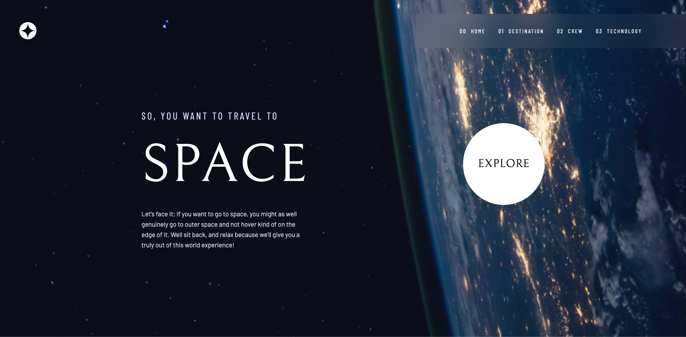

# Frontend Mentor - Space tourism website solution

This is a solution to the [Space tourism website challenge on Frontend Mentor](https://www.frontendmentor.io/challenges/space-tourism-multipage-website-gRWj1URZ3). Frontend Mentor challenges help you improve your coding skills by building realistic projects.

## Table of contents

- [Overview](#overview)
  - [The challenge](#the-challenge)
  - [Screenshot](#screenshot)
  - [Links](#links)
- [My process](#my-process)
  - [Built with](#built-with)
- [Author](#author)

## Overview

### The challenge

Users should be able to:

- View the optimal layout for each of the website's pages depending on their device's screen size
- See hover states for all interactive elements on the page
- View each page and be able to toggle between the tabs to see new information

### Screenshot

### Links

- Solution URL: [frontendmentor.io/solutions/space-tourism-multipage-website-built-using-react-eAkKgfvULd](https://www.frontendmentor.io/solutions/space-tourism-multipage-website-built-using-react-eAkKgfvULd)

- Live Site URL: [space-tourism-website-beta.vercel.app](http://space-tourism-website-beta.vercel.app/)

## My process

### Built with

- Mobile-first workflow
- [React](https://reactjs.org/) - JS library
- [React-Router](https://reactrouter.com/)

## Author

- Website - [Samuel Adu](https://www.samueladu.com)
- Frontend Mentor - [@theadusamuel](https://www.frontendmentor.io/profile/theadusamuel)
- LinkedIn - [@yourusername](https://www.linkedin.com/in/theadusamuel/)
